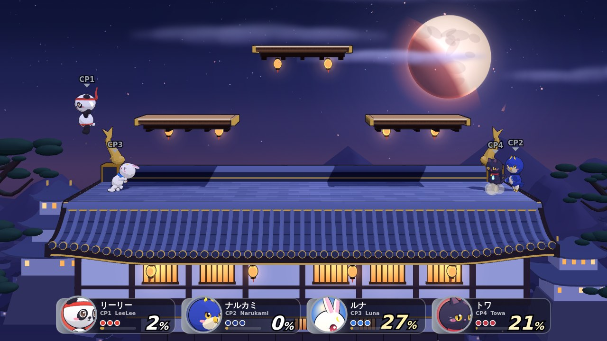

# CNP乱舞 CNP RANBU

**CNP（CryptoNinja Partners）** のキャラクターたちが 3D で大乱闘する、**スマブラ風プラットフォーム対戦ゲーム**（非公式ファンメイド）。
各キャラの「パートナーの忍者」の設定を **MCP（Model Context Protocol）サーバー「NINJAMCP」に接続して取得**し、忍者の忍術・得物からワザと性能を組み立てています。



- **CNP 9体**: リーリー（パンダ）・ミタマ（おばけ）・ナルカミ（鷹）・オロチ（白蛇）・ルナ（うさぎ）・ヤーマ（小鬼）・マカミ（オオカミ）・トワ（黒猫）・セツナ（白猫）
- **月蝕綺譚 4体**（CryptoNinja 外伝「月蝕綺譚 -Luna Occulta-」の御霊）: 於兎・シャオラン・オロチ・エマ。3D モデルは公式配布のモデルを組み込んでいます（下の「月蝕綺譚について」）
- キャラもステージも **three.js の 3D**（トゥーン調・輪郭線・リアルタイムの影）。キャラのモデルはすべて手続き生成で、色・体型・顔の特徴は[素材屋CNP](https://sozaiya.cryptoninja-partners.xyz/)の公式イラストを見て寄せています（イラスト自体は使っていません）
- 蓄積ダメージ％とふっとばし、ストック制／時間制、最大 4 人（人間・CPU 混在）
- 弱・強・スマッシュ（タメ）・空中攻撃・必殺ワザ4種・つかみ／投げ・ガード／回避／空中回避・崖つかまり・受け身・ずらし
- **奥義**: ゲージ満タンで通常必殺ワザが大技に変化（キャラが巨大化する演出つき）
- CPU は Lv1〜9（復帰・崖待ち・ガード・投げの判断あり）
- ステージ 4 種（伊賀の里・天守閣／天界・雲上の舞台／根の国・封印の祠／雑賀の港・船上決戦）
- 効果音・BGM はすべて Web Audio で手続き生成（音声ファイルなし）
- キーボード 2 人・ゲームパッド・スマホのタッチ操作に対応

## 遊び方

```bash
npm install
npm run dev        # http://localhost:5173
```

| 操作 | キーボード1（1P） | キーボード2（2P） | ゲームパッド |
| --- | --- | --- | --- |
| 移動 | W A S D | 矢印キー | Lスティック / 十字 |
| ジャンプ | Space | `/` | X / Y（上はじき） |
| 攻撃（方向で強攻撃） | J（F） | `,` | A |
| スマッシュ攻撃（長押しでタメ） | I（R）+方向 | `;` | Rスティック / はじき+A |
| 必殺ワザ（方向で4種） | K（G） | `.` | B |
| ガード・回避（空中で空中回避） | L / 左Shift | `'` / 右Shift | R / ZL / ZR |
| つかみ | U（T） | P | L |
| ポーズ | Enter / Esc | — | START |

- ガード中に横で回避、下でその場回避、攻撃でつかみ。つかんだら方向で投げ、攻撃でつかみ打撃。
- 崖から落ちたら空中ジャンプ＋上必殺ワザで復帰。崖つかまり直後は少しの間無敵。
- ふっとび中の方向入力で「ずらし」、着地の瞬間にガードで「受け身」。
- 2P はキャラ選択画面でキーボード2のボタンかパッドのボタンを押すと参加。CPU のキャラはスロットをクリックしてから選択。

## キャラクターと MCP 連携

CNP の各キャラは CryptoNinja の忍者の「パートナー」です。ゲームは MCP でパートナーの忍者の情報を引き、それを元にワザを決めています。

| CNP | 種族 | パートナーの忍者（MCP） | 通常ワザ | 必殺ワザ |
| --- | --- | --- | --- | --- |
| リーリー | パンダ | シャオラン（甲賀）太極拳・口寄せ | 太極拳 | 巨大化パンチほか（MCP の「巨大化する」設定から） |
| ミタマ | おばけ | 瀬織（雑賀）木槌・丑の刻参り | 木槌 | 丑の刻参り |
| ナルカミ | 鷹 | ハヤテ（伊賀）鷹・鷹の目 | 翼 | 鳴神・落雷／鷹の目・見切り |
| オロチ | 白蛇 | 蛇ノ目（風魔）毒手裏剣・口寄せ | 尾のムチ | 毒霧 |
| ルナ | うさぎ | 於兎（甲賀）巻物・口寄せ | 兎脚 | 口寄せ・兎走り／月跳び |
| ヤーマ | 小鬼 | イブキ（風魔）呪符・泰山府君祭 | 金棒 | 泰山府君祭 |
| マカミ | オオカミ | 紫苑（伊賀）鉤爪・野アザミ | 鉤爪 | 野アザミ |
| トワ | 黒猫 | 久遠（雑賀）鬼火・猫の目の選択 | 鬼火 | 猫の目の選択 |
| セツナ | 白猫 | 久遠（雑賀） | 猫爪 | 刹那（瞬身・見切り） |

```
NINJAMCP (MCP サーバー, stdio)                 scripts/sync-roster.ts (MCP クライアント)
  get_character  ─────────────────────────▶  パートナーの忍者の ID・クラン・忍術・得物・誕生日
  search_lore    ─────────────────────────▶  CNP キャラの名前で全文検索し、忍者のプロフィールに
                                               パートナーとして載っているかを照合（本文は保存しない）
  get_worldview  ─────────────────────────▶  クラン構成・データ出典
                                                   │
                                                   ▼
                                     src/data/roster.generated.json（事実情報のみ）
                                                   │
                                                   ▼
            src/game/roster.ts: 得物 → 通常ワザ／忍術 → 必殺ワザ／種族 → 体格・重さ・ジャンプ力
```

```bash
npm run sync:roster                        # NINJAMCP に接続して再生成
npm run sync:roster -- --server /path/to/ninjamcp/dist/index.js
```

- NINJAMCP（[omikirin/mcp](https://github.com/omikirin/mcp), MIT）は `optionalDependencies` として導入され、`.mcp.json` にも登録済みです。
- 忍者のプロフィールにパートナーとして名前が出てくるのは 5 体（リーリー・ミタマ・ナルカミ・オロチ・ヤーマ）。ルナ・マカミ・トワ・セツナのパートナー関係は CNP 公式の公開情報に基づきます。
- 生成ファイルには**事実情報だけ**を保存します。プロフィール本文などの文章は取り込みません。

### 月蝕綺譚について

CryptoNinja 外伝「月蝕綺譚 -Luna Occulta-」（Studio VIBE）の御霊 4 体も、CNP と同じ一覧から選べます。

| 御霊 | 里・五行 | 得物（通常ワザ） | 必殺ワザ（名前は公式の忍術から） |
| --- | --- | --- | --- |
| 於兎 | 甲賀・土 | 兎拳 | うさぎどーん！／うさぎどっかーん！ |
| シャオラン | 甲賀・土 | 太極拳 | 口寄せ・リーリー／肩ならべ双掌打／太極・化勁 |
| オロチ | 風魔・水 | 叢雲（刀） | 水遁・白露／鎌首／叢雲抜き放ち |
| エマ | 甲賀・金 | 一角槍 | 夢路・星こぼし／一角突き／蝕夢・角むすび |

- **3D モデル**: 月蝕綺譚の二次創作「[3Dの間](https://vibe.co.jp/luna-occulta/fanworks/models)」で配布されている公式モデル（ゲーム版 GLB）を、[二次創作ガイドライン](https://vibe.co.jp/luna-occulta/fanworks)に沿ってゲームに組み込んでいます（`src/assets/kitan/`、出典と sha256 は同じフォルダの README）。**モデル単体の再配布・モデル集としての転載はできません。**
- 公式モデルの骨は 6 本（脚は 1 本）なので、元の割り当てと頂点の位置から、共通骨格の肩・肘・股・膝へ割り当て直して動かしています（`src/render3d/characters/kitan.ts`）。オロチは下半身がとぐろの蛇なので脚は分けません。
- 里・五行・忍術の名前は公式サイトの正典シートの公開情報から取り、説明文と性能は本作オリジナルです。CNP と名前がかぶるオロチ・エマは別のキャラ（ID は `k_orochi`・`k_emma`）。
- 設定資料の MCP（`kitan-lore`・原作用の `cn-lore`。認証不要）の[つなぎ方](https://vibe.co.jp/luna-occulta/fanworks/mcp)も公開されていますが、開発に使ったクラウド環境からは接続できなかったため、今回は公式サイトの公開ページを参照しました。

## 開発

```bash
npm test            # 単体テスト＋全キャラの CPU 対戦シミュレーション（vitest）
npm run e2e         # ブラウザでタイトル→選択→対戦を通しで確認（Playwright、WebGL を含む）
npm run typecheck
npm run build       # dist/
npm run build:single  # dist-single/index.html（JS・CSS を埋め込んだ1ファイル版）
```

`npm run dev` 中は確認用ページも開けます: `/dev/models.html`（全キャラのモデルとポーズ）、`/dev/stages.html?stage=iga`（ステージ単体）、`/dev/world.html`（仮モデルでの描画テスト）。

| ディレクトリ | 内容 |
| --- | --- |
| `src/game/` | 物理・状態遷移（fighter）、当たり判定・ふっとばし（match / combat）、ステージ、CPU（ai）、ワザ生成（moves/）、名簿（roster） |
| `src/render3d/` | 3D 描画: ゲームのカメラと一致させた three.js のカメラ（view）、共通の骨格（rig）、キャラのモデル（characters/）、ステージ（stages/）、マフラー・軌跡、アイコン生成 |
| `src/render/` | 3D の上に重ねる 2D: エフェクト・飛び道具・HUD、姿勢ライブラリ（rig） |
| `src/ui/` | タイトル・キャラ選択・ステージ選択・対戦・リザルトの各画面、タッチ操作 |
| `src/core/` | 入力（キーボード / パッド / タッチ）、手続き生成サウンド、数学ユーティリティ |
| `scripts/sync-roster.ts` | MCP クライアント（NINJAMCP → 名簿 JSON） |

## クレジット・ガイドライン

- **CNP（CryptoNinja Partners）**・**CryptoNinja** は Ninja DAO / イケハヤ氏による IP です。本作は**非公式・非営利のファンメイド作品**で、公式とは関係ありません。二次創作の範囲は公式の[利用ガイドライン](https://www.ninja-dao.com/guidelines)で定められているので、公開・配布・商用利用の前に必ず確認してください。
- CNP 9体の 3D モデル・ステージは本作オリジナルの手続き生成です。公式イラストはリポジトリに含めず、ゲーム中でも使用していません。
- 月蝕綺譚の御霊の 3D モデルは月蝕綺譚の公式配布モデルです（二次創作ガイドラインの範囲で組み込み）。本作は月蝕綺譚の公式とも関係のない非公式ファンメイドです。#月蝕綺譚
- モデルの見た目は素材屋CNP の公式イラストを参考にしました。同サイトの AI 利用ガイドライン（AI に読み込ませるのは合計 10 点まで）に従い、参照したのは 1 体 1 点・合計 9 点だけで、画像は作業後に削除しています。
- キャラクター設定データ: NINJAMCP 経由（出典: [【保存版】CryptoNinja 世界観とキャラクター設定まとめ](https://note.com/danku_mj/n/n8be2e96f1fbe)（だんく氏））
- NINJAMCP: MIT License（omikirin）／ three.js: MIT License
- ゲームのプログラム・エフェクト・効果音・BGM はすべて本作オリジナル（手続き生成）です。
